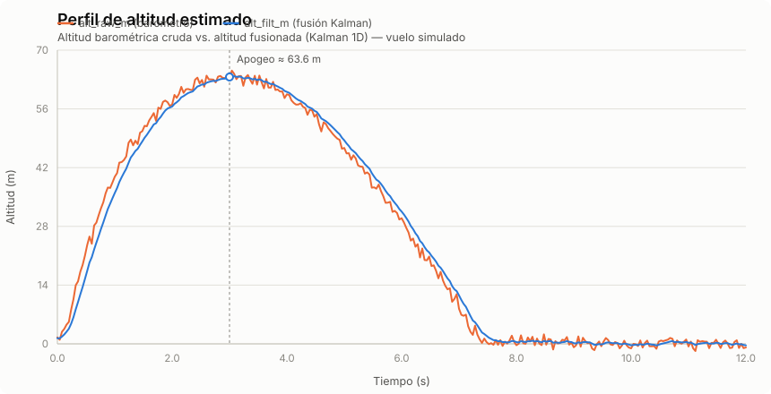
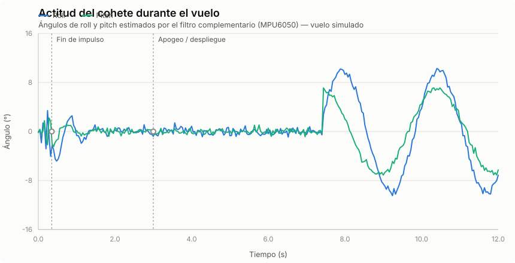

# WaterRocket Altitude

Firmware para ESP32 que estima en tiempo real la **altitud** y la **actitud** (roll/pitch) de un cohete de agua, fusionando un barómetro (BMP280/BMP180) con una IMU (MPU6050) mediante un filtro complementario y un filtro de Kalman 1D. Los datos se transmiten por puerto serie en formato CSV para su registro y posterior análisis de vuelo.

## Tabla de contenidos

- [Hardware](#hardware)
- [Conexiones](#conexiones)
- [Cómo funciona](#cómo-funciona)
- [Gráficos de vuelo](#gráficos-de-vuelo)
- [Formato de datos de salida](#formato-de-datos-de-salida)
- [Puesta en marcha](#puesta-en-marcha)
- [Parámetros de ajuste](#parámetros-de-ajuste)
- [Limitaciones conocidas](#limitaciones-conocidas)
- [Referencias](#referencias)

## Hardware

| Componente | Función | Notas |
|---|---|---|
| ESP32 (DevKit) | Microcontrolador principal | Bus I2C en GPIO21 (SDA) / GPIO22 (SCL) |
| MPU6050 | Acelerómetro + giroscopio (IMU) | Dirección I2C `0x68` |
| BMP280 *(por defecto)* | Barómetro / sensor de presión y temperatura | Dirección I2C `0x76` o `0x77` |
| BMP180 *(alternativo)* | Barómetro | Seleccionable mediante `#define` |

Librerías Arduino requeridas: `Wire`, `Adafruit_Sensor`, `Adafruit_MPU6050`, `Adafruit_BMP280` (o `Adafruit_BMP085` para BMP180).

## Conexiones

```
ESP32          MPU6050 / BMP280
-----          ----------------
3V3  --------  VCC
GND  --------  GND
GPIO21 (SDA) -- SDA
GPIO22 (SCL) -- SCL
```

Ambos sensores comparten el mismo bus I2C.

## Cómo funciona

El sketch (`AltitudSens/AltitudSens.ino`) ejecuta el siguiente pipeline a 25 Hz (`SAMPLE_MS = 40 ms`):

1. **Calibración inicial (`calibrateAll`)** — durante ~12 s (300 muestras) en reposo sobre la rampa de lanzamiento:
   - Promedia la presión atmosférica de referencia `p0_pa` (altitud = 0).
   - Estima el *bias* del giroscopio en los tres ejes.
   - Calcula la actitud inicial (roll/pitch) a partir del acelerómetro.
   - Estima el *bias* de la aceleración vertical lineal (`az_bias`), proyectando la aceleración del cuerpo al marco global con la actitud inicial.

2. **Lectura robusta del barómetro (`updatePressureRobust`)** — la presión cruda pasa por tres etapas para atenuar ruido y saltos espurios:
   - *Clamp* de salto máximo entre muestras (`MAX_PRESS_STEP_PA`).
   - Filtro de **mediana** de 5 muestras (`P_MED_WIN`).
   - Suavizado exponencial (**EMA**, `P_EMA_ALPHA`).

3. **Conversión presión → altitud** mediante la fórmula barométrica internacional:

   `h = 44330 · (1 − (p / p0)^0.1903)`

4. **Estimación de actitud (filtro complementario)** — combina la integración del giroscopio (alta frecuencia, deriva a largo plazo) con el ángulo derivado del acelerómetro (baja frecuencia, ruidoso pero sin deriva):

   `θ = α·(θ_gyro_integrado) + (1−α)·θ_accel`, con `ATT_ALPHA = 0.98`.

5. **Fusión de altitud (filtro de Kalman 1D)** — estado `[altura, velocidad vertical]`:
   - **Predicción**: integra la aceleración lineal vertical (proyectada a ejes globales con roll/pitch) mediante un modelo de aceleración constante.
   - **Corrección**: actualiza con la altitud barométrica filtrada, con una *gate* (`INNOV_GATE_M`) que rechaza lecturas atípicas del barómetro.

6. **Salida por Serial** a 115200 baudios en formato CSV.

### Diagrama del pipeline

```
 BMP280/BMP180 ──► clamp ─► mediana ─► EMA ─► presión→altitud ─┐
                                                                ├─► Kalman 1D ─► alt_filt_m
      MPU6050  ──► bias gyro ─► filtro complementario (roll/pitch)
                        │
                        └─► proyección body→world (az) ────────┘
```

## Gráficos de vuelo

> Los siguientes gráficos son **simulaciones ilustrativas** de un vuelo típico generadas a partir del modelo físico del cohete.

### Altitud (cruda vs. fusionada)



Se observa cómo `alt_raw_m` (barómetro sin filtrar) es ruidosa, mientras que `alt_filt_m` (salida del Kalman 1D, fusionada con la IMU) sigue una trayectoria suave y detecta el apogeo con mayor precisión.

### Actitud del cohete (roll / pitch)



Durante el impulso inicial (propulsión por expulsión de agua) se aprecian oscilaciones de alta frecuencia por la inestabilidad aerodinámica de despegue; en el ascenso libre el cohete se estabiliza; tras el apogeo y el despliegue del paracaídas, el roll/pitch vuelven a oscilar por el balanceo tipo péndulo durante el descenso.

## Formato de datos de salida

Tras la calibración, el firmware imprime por Serial una cabecera y luego una fila CSV por muestra:

```
ms,alt_raw_m,alt_filt_m,dP_pa,dH_m
```

| Campo | Descripción | Unidad |
|---|---|---|
| `ms` | Tiempo desde el fin de la calibración | ms |
| `alt_raw_m` | Altitud instantánea a partir de la presión cruda | m |
| `alt_filt_m` | Altitud fusionada (Kalman 1D, barómetro + IMU) | m |
| `dP_pa` | Variación de presión filtrada respecto a `DELTA_WINDOW` muestras atrás | Pa |
| `dH_m` | Variación de altitud fusionada respecto a `DELTA_WINDOW` muestras atrás | m |


## Puesta en marcha

1. Instala en el IDE de Arduino (o PlatformIO) las librerías: `Adafruit MPU6050`, `Adafruit Unified Sensor`, `Adafruit BMP280` (o `Adafruit BMP085` si usas BMP180).
2. Conecta el BMP280/BMP180 y el MPU6050 al bus I2C del ESP32 (GPIO21/GPIO22).
3. Abre `AltitudSens/AltitudSens.ino`, selecciona la placa ESP32 correspondiente y el puerto serie.
4. Si usas BMP180 en lugar de BMP280, comenta `#define USE_BMP280 1` y descomenta `#define USE_BMP180 1` (son mutuamente excluyentes).
5. Carga el sketch. Mantén el cohete inmóvil y nivelado durante la fase de calibración (~12 s, indicada por `# CAL_START` / `# CAL_DONE` en el monitor serie).
6. Tras `# CAL_DONE`, el firmware comienza a imprimir las filas CSV a 25 Hz.

## Parámetros de ajuste

| Parámetro | Rol | Valor por defecto |
|---|---|---|
| `SAMPLE_MS` | Periodo de muestreo | 40 ms (25 Hz) |
| `CALIB_SAMPLES` | Muestras de calibración | 300 (~12 s) |
| `MAX_PRESS_STEP_PA` | Límite de salto de presión entre muestras | 25 Pa |
| `P_EMA_ALPHA` | Peso del suavizado exponencial de presión | 0.18 |
| `P_MED_WIN` | Ventana del filtro de mediana de presión | 5 |
| `ATT_ALPHA` | Peso del giroscopio en el filtro complementario | 0.98 |
| `SIGMA_A` | Ruido de proceso del Kalman (aceleración) | 2.5 m/s² |
| `R_BARO` | Varianza de medición del barómetro | 0.64 m² |
| `INNOV_GATE_M` | Umbral de rechazo de outliers en la actualización | 8 m |
| `DELTA_WINDOW` | Ventana para calcular `dP_pa` / `dH_m` | 10 muestras |

## Limitaciones conocidas

- La calibración asume que el cohete permanece **inmóvil y nivelado** en la rampa; un movimiento durante este paso degrada la referencia de presión, los *bias* del giroscopio y el *bias* de aceleración vertical.
- El modelo de actitud (roll/pitch) no estima **yaw**, ya que no hay magnetómetro ni fusión de cuaternión completa.
- La fórmula barométrica usada asume condiciones estándar de atmósfera; en vuelos de alta velocidad vertical, la respuesta del sensor de presión puede introducir retardo adicional no modelado explícitamente.
- No se gestiona la finalización/apagado tras el aterrizaje: el firmware continúa transmitiendo indefinidamente.

## Referencias

1. Adafruit Industries. *Adafruit MPU6050 6-DoF Accel and Gyro Sensor — Arduino Library*. [https://github.com/adafruit/Adafruit_MPU6050](https://github.com/adafruit/Adafruit_MPU6050)
2. Adafruit Industries. *Adafruit BMP280 Library*. [https://github.com/adafruit/Adafruit_BMP280_Library](https://github.com/adafruit/Adafruit_BMP280_Library)
3. Bosch Sensortec. *BMP280 Digital Pressure Sensor — Datasheet*. [https://www.bosch-sensortec.com/products/environmental-sensors/pressure-sensors/bmp280/](https://www.bosch-sensortec.com/products/environmental-sensors/pressure-sensors/bmp280/)
4. InvenSense/TDK. *MPU-6000 and MPU-6050 Product Specification*. [https://invensense.tdk.com/products/motion-tracking/6-axis/mpu-6050/](https://invensense.tdk.com/products/motion-tracking/6-axis/mpu-6050/)
5. Mahony, R., Hamel, T., & Pflimlin, J.-M. (2008). *Nonlinear Complementary Filters on the Special Orthogonal Group*. IEEE Transactions on Automatic Control, 53(5), 1203–1218.
6. Welch, G., & Bishop, G. (2006). *An Introduction to the Kalman Filter*. TR 95-041, University of North Carolina at Chapel Hill. [https://www.cs.unc.edu/~welch/media/pdf/kalman_intro.pdf](https://www.cs.unc.edu/~welch/media/pdf/kalman_intro.pdf)
7. U.S. Standard Atmosphere, 1976. NOAA/NASA/USAF. (Base de la fórmula barométrica presión→altitud empleada en `pressureToAltitudeM`.)
8. Thiébaud, C. (NASA Glenn Research Center). *Rockets — Water Rocket Principles*. [https://www.grc.nasa.gov/www/k-12/rocket/BottleRocket/about.html](https://www.grc.nasa.gov/www/k-12/rocket/BottleRocket/about.html)


